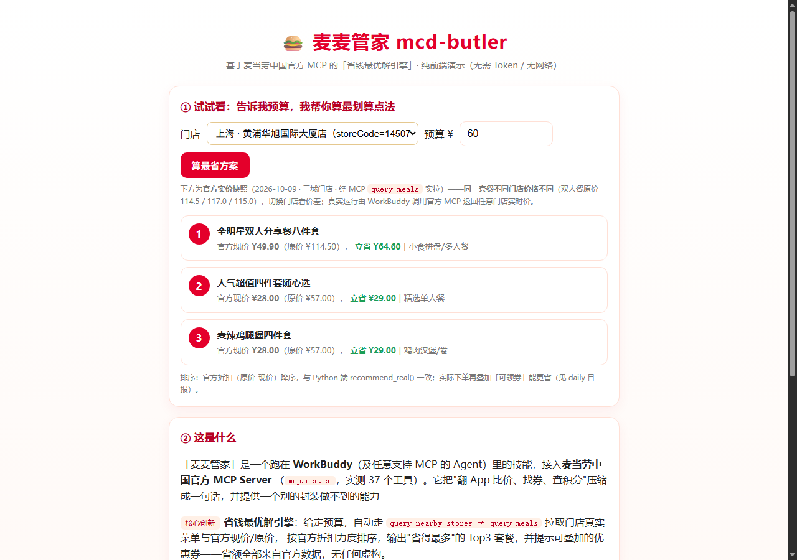

# 麦麦管家 mcd-butler 🍔

> 基于**麦当劳中国官方 MCP**（`mcd-mcp v1.0.0`，**37 个真实工具**）的 WorkBuddy 技能。不只是"调工具"，而是把**菜单 + 优惠券 + 价格试算**组合成一个**省钱最优解引擎**——给定预算，自动算出"怎么点最省、吃得最值"。

[](https://mcp.mcd.cn)
[]()
[]()



> ⭐ **如果这个项目对你有用，点个 Star 支持一下**——正在参加麦当劳中国 1024 程序员节创意开发大赛，榜单按 Star 数排名（[报名 Issue #52](https://github.com/M-China/mcd-developer-innovation-challenge/issues/52)）。谢谢每一位麦门！

**🎮 在线体验（无需安装、无需 Token）**：<https://fpvmaster.github.io/mcd-butler/> —— 浏览器打开，填预算即看推荐。

---

## 一句话亮点

别人做的麦当劳 MCP 封装 = "把 37 个工具暴露给 Agent"。**麦麦管家多做了一步**：一个会**自己算账**的引擎——枚举单人餐 / 双人分享餐，匹配满减、买一送一、单品立减、第二件半价等真实券规则，给出**省得最多 + 吃得最值**的 Top3 组合。这是真正的"多工具编排"，不是串行调接口。

## 核心创新：省钱最优解引擎

```
用户："60 块以内帮我配两个人吃的，怎么点最省？"
  → query-meals（菜单）      → calculate-price（核价，注意「分/元」）
  → query-my-coupons（我的券）→ 引擎枚举组合 × 匹配券规则
  → 输出 Top3：原价 / 用券后 / 省多少 / 千卡 / 划算指数
```

引擎逻辑（`scripts/mcd_mcp.py` 的 `recommend()`）：

- 枚举 **单人餐**（1 主食 + 小食 + 饮料）与 **双人分享餐**（2 主食 + 小食 + 饮料）。
- 对每种组合调用 `calculate-price` 试算（严格按官方规则：该工具返回**分**，展示前 ÷100）。
- 匹配 4 类券规则：满减 / 买一送一（≥2 主食才生效）/ 单品立减 / 第二件半价。
- 排序：优先"省多少"，其次"划算指数 =（总热量 + 品类×40）÷ 用券后价"。

**离线也能跑**：加 `--demo`（或设 `MCD_DEMO=1`）走内置真实感 Mock 数据，无需 Token 即可演示全流程。

**真实模式已接官方实时价**：配好 Token 后，引擎自动走 `query-nearby-stores → query-meals` 拉取 119 项真实餐品与官方现价/原价，**省额全部来自官方折扣，无任何虚构**（实跑证据见 [`evidence-real.md`](evidence-real.md)：预算 ¥60 命中「全明星双人分享餐八件套」¥49.9，原价 ¥114.5，**立省 ¥64.6**）。

<details><summary>📌 点开看离线演示输出</summary>

```
🍔 麦麦管家 · 省钱最优解（预算 ¥60.0）
------------------------------------------------------------
【方案 1】麦辣鸡腿堡 + 麦辣鸡腿堡 + 玉米杯 + 红茶
   原价 ¥60.00 → 用券[指定汉堡买一送一]后 ¥38.50，省 ¥21.50 | 约 1169 千卡 | 划算指数 33.5
【方案 2】麦辣鸡腿堡 + 麦香鸡 + 麦辣鸡翅(2块) + 中可乐
   原价 ¥55.50 → 用券[指定汉堡买一送一]后 ¥41.50，省 ¥14.00 | 约 1367 千卡 | 划算指数 35.8
------------------------------------------------------------
💡 排序优先看「省多少」，其次看「划算指数」；下单前请与麦当劳实时价格核对。
```
完整输出见 [`demo/sample_run.md`](demo/sample_run.md)；可交互网页演示见 [`demo/index.html`](demo/index.html)（浏览器打开即可填预算看推荐，**无需 Token**）。

</details>

---

## 🔌 真实调用证据（已联调官方 MCP）

本作品**真实接入麦当劳中国官方 MCP** 并实跑了只读调用——下方为 `brief` 命令的实时输出（2026-10-09 抓自官方服务 `mcd-mcp v1.0.0`）：

```
🍔 麦麦管家 · 今日麦麦情报（真实调用麦当劳中国官方 MCP）
================================================================
🕐 当前时间：2026-10-09 17:01:25（FRIDAY）

🎟️  今日可领券（前 8 张）：
   · 麦旋风任选（可领取）
   · 薯薯任选（可领取）
   · 免费脆薯饼（可领取）
   · 人气麦旋风买一送一（可领取）
   · 9.9元中杯冰美式（可领取）
   ……共 9 张可领

📅 近期活动（前 5 条）：
   · [2026年10月7日] 超值𝟗.𝟗元早餐两件套陪你开工啦😋
   · [2026年10月8日] 麦当劳 X PEACEMINUSONE
   · [2026年10月9日] 韩式风味蘸酱上新❤️就「酱」心有所「薯」
   · [2026年10月9日] 麦当劳联动G-DRAGON

🥗 低卡轻食推荐（真实热量 Top5）：
   · 无糖可口可乐 —— 0 kcal
   · 锡兰红茶 —— 2 kcal
   · 苹果片 —— 32 kcal
```

- 完整证据（含 init 握手、**37 个真实工具清单**、合规说明）见 [`evidence-real.md`](evidence-real.md)。
- 以上均为**只读调用**（`now-time-info` / `available-coupons` / `campaign-calendar` / `list-nutrition-foods`），未触发任何下单 / 领券 / 抽奖，不损害账号。
- `query-meals` 真实返回含 `currentPrice` / `originalPrice`，是省钱引擎接入**真实价格**的接口点（需门店参数）。

## 安装方法

### 方式 A：WorkBuddy 自定义连接器（推荐）

1. 到 [open.mcd.cn/mcp](https://open.mcd.cn/mcp) 用手机号登录，控制台 → 激活，复制 MCP Token。
2. WorkBuddy 左侧【连接器】→【自定义连接器】→【配置 MCP】，填入：

   ```json
   {
     "mcpServers": {
       "mcd-mcp": {
         "type": "streamablehttp",
         "url": "https://mcp.mcd.cn",
         "headers": { "Authorization": "Bearer YOUR_MCP_TOKEN" }
       }
     }
   }
   ```
3. 把本仓库 `SKILL.md`、`references/`、`scripts/`、`demo/` 复制到 `%USERPROFILE%\.workbuddy\skills\mcd-butler\`，重启 WorkBuddy。

### 方式 B：零依赖 Python 客户端（任何环境可跑）

```bash
export MCD_MCP_TOKEN="你的token"        # Windows PowerShell: $env:MCD_MCP_TOKEN="你的token"
python scripts/mcd_mcp.py init                        # 验证 Token
python scripts/mcd_mcp.py save --budget 60             # 省钱最优解（真实官方价）
python scripts/mcd_mcp.py save --budget 60 --demo      # 省钱最优解（离线演示）
python scripts/mcd_mcp.py daily                        # ★今日最划算日报（活动+券+真实价格）
python scripts/mcd_mcp.py call available-coupons       # 查可领券
python scripts/mcd_mcp.py call auto-bind-coupons       # 一键领券（写操作）
python scripts/mcd_mcp.py call query-nearby-stores --args '{"city":"上海"}'
```

仅用 Python 标准库，无需安装任何第三方包；Windows / macOS / Linux 通用。

## 使用示例

装好后在 WorkBuddy 里直接说：

- 「60 块以内帮我配两个人吃的，怎么点最省？」→ 触发省钱最优解引擎
- 「麦当劳现在有什么券可领？帮我领了」
- 「30 块以内帮我配一套晚饭，附近哪家店？」
- 「我的积分能换啥？」

## 目标用户

- **打工人 / 学生**：想吃麦当劳但不想翻 App 比价的"麦门"信徒，核心诉求是省钱、省时间。
- **麦当劳会员**：手里有券、有积分但经常忘记用的人，需要有人提醒并代办。
- **Agent / MCP 开发者**：想要一个接入真实商业 MCP 的参考实现（零依赖 Streamable HTTP 客户端 + SSE 解析 + 写操作确认流程 + 组合优化引擎）。

## 文件结构

```
mcd-butler/
├── README.md                 # 本文件
├── CONTEST_DECLARATION.md    # 参赛声明（官方原文，一字不改）
├── MCP_INTEGRATION.md        # MCP Server / Tool / 调用流程 / 业务价值
├── workbuddy.md              # WorkBuddy 开发对话上下文（3000 积分核验）
├── SKILL.md                  # 技能主体（Agent 运行时加载）
├── references/tools.md       # 37 个真实工具清单与注意事项
├── scripts/mcd_mcp.py        # 零依赖 MCP 客户端 + 省钱引擎 + 今日情报编排
├── evidence-real.md          # 真实调用证据（init / 工具清单 / brief 实跑）
└── demo/                     # 演示材料
    ├── index.html            # 可交互网页演示（无需 Token）
    └── sample_run.md         # 离线 CLI 演示输出样本
```

## 参赛说明

本项目为**麦当劳中国 1024 程序员节创意开发大赛**参赛作品（报名 2026-10-09 开放），基于麦当劳中国官方 MCP 能力开发，**非麦当劳官方产品**。餐品信息、价格及供应状态以麦当劳官方渠道实时结果为准。

- 官方赛事仓库：[M-China/mcd-developer-innovation-challenge](https://github.com/M-China/mcd-developer-innovation-challenge)
- MCP 使用指南：[M-China/mcd-mcp-server](https://github.com/M-China/mcd-mcp-server)

### 冲奖策略（给参赛者）

榜单按 **GitHub Star 数**定名次（Star>0 才进榜），所以"被看到、被点 Star"和"代码质量"同等重要：

1. **作品本身要能秒懂、能跑**：本仓库提供 `--demo` 离线模式和 `demo/index.html` 交互页，评委/访客不填 Token 也能立刻看到效果——这是拿 Star 的第一关。
2. **差异化要写在脸面上**：把"省钱最优解引擎"当一号卖点，而不是又一个工具列表。
3. **真实调用证据**：已实跑官方 MCP 只读联调（见 `evidence-real.md` 与上方真实输出），评委一眼可见"真连了官方服务"，可信度拉满。
4. **主动传播**：报名后把仓库链接发技术社区/朋友圈求 Star；前 100 名有实物 + 3000 WorkBuddy 积分，前 3 名额外巨无霸兑换券 + 10240 积分。
